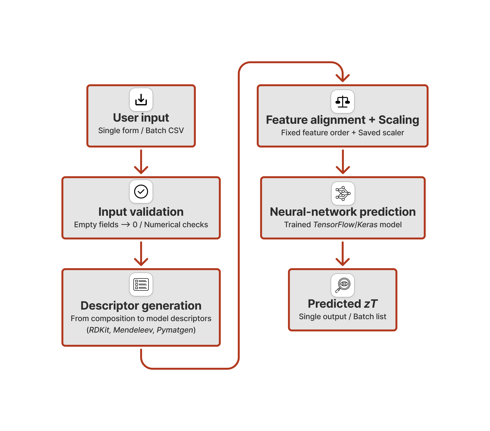

# Summary

zTSkut is a Python-based web application for predicting the thermoelectric figure of merit, zT, of skutterudite-based compositions. The software provides both a browser interface for single-composition prediction and a CSV-upload workflow for batch screening. Users specify the anion, cation and filler species, their corresponding fractions, carrier concentration at 300 K, temperature and carrier type. zTSkut then generates the same compositional descriptors used by the trained neural-network model, applies the saved feature scaling from the original training workflow and returns predicted zT values.

The backend generates the compositional descriptors required by the trained neural-network model, orders them according to the original feature list, applies the saved `StandardScaler` from the training workflow, and returns predicted zT values. This ensures that user predictions follow the same preprocessing pathway as the published model-development study. zTSkut is built with a FastAPI backend and a lightweight HTML/CSS/JavaScript frontend, and includes input validation to catch common formatting errors.

# Statement of need

Skutterudites are an important family of thermoelectric materials because their structure allows chemical tuning through filler, cation and anion substitution. This large compositional flexibility makes them suitable for computational screening, but it also creates a practical barrier for experimental researchers: evaluating many candidate compositions using first-principles transport calculations or synthesis is expensive and slow. Machine learning (ML) models can help prioritise promising candidates, but they are only useful to the broader community if they can be accessed without requiring users to reproduce the full training and descriptor-generation workflow.

zTSkut addresses this need by exposing the trained skutterudite zT model from Posligua et al. [@posligua2026skutterudites] through a simple web interface. The purpose of zTSkut is not to replace that model-development study, but to make the trained predictor usable for screening new skutterudite candidates. The app allows users to test individual compositions interactively or upload large candidate lists for batch prediction. This is particularly useful for researchers designing filled or multi-filled skutterudites and looking for a rapid first-pass estimate of thermoelectric performance before more expensive experimental or computational validation.

# State of the field

Several ML models have been developed for thermoelectric materials, including models trained on broad thermoelectric datasets or on specific material families. However, these models are often published primarily as methodological studies, with limited user-facing software for applying the trained model to new candidate compositions. In practice, reusing such models can require reproducing the original descriptor generation, feature ordering, scaling and loading workflow, which creates a barrier for experimental or computational users who simply want to screen new compositions.

This follows a broader trend in scientific computing, where AI models are increasingly used as surrogates to accelerate exploration of large parameter spaces, provided that predictions remain within the model domain and promising outcomes are verified with higher-fidelity calculations or experiments [@dongarra2026scientific].

General purpose ML platforms and Python libraries such as TensorFlow/Keras [@tensorflow; @keras] and scikit-learn [@scikit-learn] provide the underlying infrastructure for training and deploying models, but they do not provide a domain-specific interface for skutterudite zT prediction. Similarly, web frameworks such as FastAPI [@fastapi] make deployment possible, but they do not encode the thermoelectric descriptor logic, saved model artefacts or input conventions required for this specific skutterudite predictor.

zTSkut therefore fills a focused gap: it packages the trained skutterudite model [@posligua2026skutterudites] into a reproducible and user-facing prediction tool. Rather than contributing to a general platform, zTSkut was built as a lightweight dedicated application because the model requires a specific descriptor representation, fixed feature order and saved training scaler to ensure consistency with the peer-reviewed workflow. This narrow scope is intentional: it keeps the tool easy to use, easy to deploy and directly aligned with the skutterudite screening problem.

# Software design

The main design goal of zTSkut is to make the trained skutterudite zT model accessible while preserving the exact preprocessing workflow used during model development. For this reason, the software separates the user interface from the prediction pipeline but keeps the deployment structure simple enough to run locally or on a lightweight web service.

The backend is implemented with FastAPI, with both the single-system form and the batch CSV upload passing through the same prediction workflow. The prediction script reads the input, validates numerical fields, replaces empty optional fields with zero and generates the compositional descriptors required by the trained model. Descriptor generation uses RDKit [@rdkit2024] to parse element-level chemical inputs and obtain valence-electron descriptors, while Mendeleev [@mendeleev2014] and Pymatgen [@pymatgen2013] provide elemental properties, including atomic masses as well as ionisation-energy, electron-affinity and electronegativity values. The resulting descriptor table is ordered according to `feature_columns_ZT.txt`, transformed with the saved `scaler_ZT.joblib` and finally evaluated with the trained `model_keras_skutt.h5` model. The same end-to-end prediction workflow is summarised in Figure 1.

**Figure 1.** zTSkut prediction workflow. Single-composition and batch CSV inputs are processed through the same backend pipeline, including input validation, descriptor generation with RDKit, Mendeleev and Pymatgen, feature alignment using `feature_columns_ZT.txt`, scaling with `scaler_ZT.joblib` and prediction with the trained TensorFlow/Keras model.

A deliberate trade-off was made to keep the software lightweight and transparent rather than building a more complex package architecture. The current implementation uses a small number of files so that it can be deployed easily on Render and run locally with a single Uvicorn command. This is important for the intended audience: researchers who want to use the model for candidate screening should not need to install a large framework or understand the full training workflow. At the same time, the repository includes tests for basic web app functionality, prediction through the backend endpoint and input validation, so that reviewers and users can verify that the core workflow is functioning.

The frontend is implemented as a lightweight HTML/CSS/JavaScript interface without additional frontend framework dependencies. This avoids extra deployment complexity and keeps the interface portable.

# Software functionality

The current implementation provides the following functionality:

- Single-system prediction through a browser form
- Batch prediction from CSV files
- Automatic treatment of empty optional composition and fraction fields as zero
- Generation of the compositional descriptor set expected by the trained model
- Application of the saved training scaler and fixed feature order
- Input validation for numerical fields such as fractions, temperature, carrier concentration and carrier type
- Downloadable citation files for users of the model
- Local execution through FastAPI as well as deployment as a web app

For batch predictions, users can download the CSV template, add one candidate composition per row and upload the completed file. The app returns one predicted zT value per row.

# Research impact statement

The scientific model served by zTSkut has already been peer reviewed and published in Journal of Materials Chemistry A [@posligua2026skutterudites]. In that study, the model was trained on a curated skutterudite dataset and evaluated using internal validation, independent external testing, comparison with experimental trends and physical interpretation through SHAP analysis and first-principles calculations.

zTSkut extends the impact of that work by converting the published model into an accessible screening tool. This is particularly useful for experimental and computational researchers considering new filled or multi-filled skutterudite compositions, because the software provides rapid first-pass predictions before synthesis or expensive transport calculations. The live web app, documented CSV format, citation files, local execution workflow and test suite make the model easier to reuse beyond the original manuscript and support its integration into future thermoelectric screening workflows.

# Availability and use

The web application is available at <https://ztskut.onrender.com/>. The repository provides the source code, trained model files, saved scaler, feature-column definition, CSV template, example inputs, citation files and basic tests for the web endpoint and input validation. Users can access the model either through the deployed web interface or by running the same backend prediction workflow locally using the example CSV files.

zTSkut is intended as a screening and prioritisation tool. Predictions should be interpreted within the chemical and thermoelectric domain represented by the model-development dataset. In particular, predictions for compositions far outside the training chemistry, unusual carrier concentrations or temperatures, systems affected by secondary phases, or very high-zT regimes should be treated with caution and validated experimentally or with higher-fidelity calculations.

# AI usage disclosure

No AI tools were used to assist with the code and web app. All scientific content, software behaviour, tests and final text were reviewed, edited and validated by the authors. The trained model, dataset, scientific interpretation and research conclusions are based on the peer-reviewed work [@posligua2026skutterudites].

# Acknowledgements

The trained model used by zTSkut was developed as part of the skutterudite thermoelectrics study reported in [@posligua2026skutterudites]. This work was funded by grant PID2022-138063OB-I00 funded by MICIU/AEI/10.13039/501100011033 and by FEDER, UE, and by grants TED2021-130874B-I00 and TED2021-129569A-I00 funded by MICIU/AEI/10.13039/501100011033 and by the European Union NextGenerationEU/PRTR.

The authors acknowledge the computer resources at Lusitania (Cenits-COMPUTAEX), Red Española de Supercomputación, RES (QHS-2024-1-0022 and QHS-2024-2-0020), and Albaicín (Centro de Servicios de Informática y Redes de Comunicaciones – CSIRC, Universidad de Granada).
